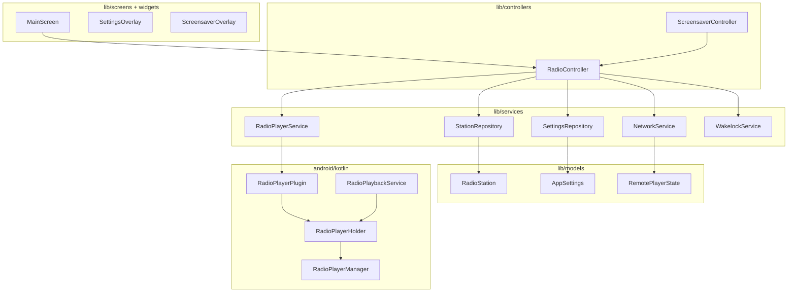

# Class overview — final project

Target structure for the Internet Radio Flutter app.  
**Legend:** ✅ exists · 🔲 planned

---

## Folder map

```
InternetRadioFlutter/
├── assets/
│   ├── settings.json              # Station list (build-time config)
│   └── images/                    # Station logos (PNG)
│
├── lib/
│   ├── main.dart                  # App entry, root wiring
│   ├── app/                       # App shell & dependency wiring
│   ├── models/                    # Data types (no I/O)
│   ├── services/                  # I/O & platform integrations
│   ├── controllers/               # Application logic (orchestration)
│   ├── screens/                   # Full-page UI
│   └── widgets/                   # Reusable UI pieces
│
└── android/app/src/main/
    ├── kotlin/.../internetradio/  # Native audio & platform channel
    └── java/.../internetradio/    # AudioRouteFixer (Java)
```

---

## Architecture flow



---

## `lib/models/` — domain data (pure Dart)

No Flutter widgets, no platform channels, no file/network I/O.

| Class | Status | Responsibility |
|-------|--------|----------------|
| **`RadioStation`** | ✅ | One station: `name`, `url`, `imageAssetPath`. JSON via `fromJson` / `listFromSettingsJson`. |
| **`OperatingMode`** | ✅ | Enum: `player` \| `remote`. |
| **`AppSettings`** | ✅ | Persisted prefs: mode, player IP, last station name, test URL, display policy. |
| **`DisplayPolicy`** | ✅ | Enum: `keepScreenOn` \| `allowScreenOff`. Player mode. |
| **`RemotePlayerState`** | ✅ | Remote snapshot: station index, muted, playing. |
| **`RadioPlayerState`** | ✅ | Live audio snapshot from native player: url, playbackState, isPlaying, isMuted, buffer, error. DTO from MethodChannel/EventChannel. |

---

## `lib/services/` — integrations & I/O

Talks to assets, disk, network, or native code. No UI.

| Class | Status | Responsibility |
|-------|--------|----------------|
| **`RadioPlayerService`** | ✅ | Dart facade for native audio. `play`, `stop`, `setMuted`, `stateStream`. Owns MethodChannel + EventChannel. |
| **`StationRepository`** | ✅ | Load `assets/settings.json`, parse stations, fallback list. Expose grid stations, URL-test slot, lookup by index/name. |
| **`SettingsRepository`** | ✅ | Read/write `AppSettings` via `shared_preferences`. |
| **`NetworkService`** | 🔲 | TCP on port **6435**. Player: run server, dispatch commands. Remote: send commands, poll state. Parse/build protocol strings. |
| **`NetworkProtocol`** | 🔲 | Static helpers: `ping`, `selectStation(n)`, `mute`, `unmute`, `getState`, `testUrl`, parse `PONG` / `STATE\|…`. Keeps string format in one place. |
| **`WakelockService`** | 🔲 | Keep screen on when **display policy** = `keepScreenOn` (Player mode). Off when `allowScreenOff` or Remote mode. |
| **`LocalNetworkInfo`** | 🔲 | Local device IP for bottom-left display (Dart or small platform helper). |

---

## `lib/controllers/` — application logic

Orchestrates services and exposes state for UI. Single place for “what happens when user taps X”.

| Class | Status | Responsibility |
|-------|--------|----------------|
| **`RadioController`** | 🔲 | **Central controller.** Owns `RadioPlayerService`, repositories, `NetworkService`, wakelock. Station select, mute, stop, mode switch (Player/Remote), restore last station, sync UI state. In Player mode: play locally + accept TCP; **incoming remote command dismisses screensaver**. Applies **display policy** via wakelock. In Remote mode: send commands + poll player. |
| **`ScreensaverController`** | 🔲 | 60s inactivity timer, show/hide screensaver, reset on local touch. Disabled while settings open. **Dismiss on remote command** (via `RadioController`). Only meaningful when display is on (`keepScreenOn`). Uses current station logo from `RadioController`. |

*Alternative:* merge `ScreensaverController` into `RadioController` if you prefer one class — split only if screensaver logic grows.

---

## `lib/app/` — wiring

| Class | Status | Responsibility |
|-------|--------|----------------|
| **`InternetRadioApp`** | ✅ (in `main.dart`) | `MaterialApp`, theme, home route. |
| **`AppScope` / providers** | 🔲 | Create single `RadioController`, `RadioPlayerService`, repos; inject into widget tree (`Provider`, `Riverpod`, or manual inheritance). |

---

## `lib/screens/` — full pages

| Class | Status | Responsibility |
|-------|--------|----------------|
| **`MainScreen`** | 🔲 | Main radio UI. Static controls inline in MainScreen: mute, mode toggle, IP, settings opener, exit, current station name. Composes `StationGrid`; stacks overlays. Reads `RadioController`. |

*PoC today:* `RadioPocScreen` in `main.dart` — replace with `MainScreen` at M1.

---

## `lib/widgets/` — extracted UI only

Extract when repeated, layout-heavy, or a separate layer. Everything else stays in `MainScreen`.

| Class | Status | Why separate | Responsibility |
|-------|--------|----------------|----------------|
| **`StationTile`** | 🔲 | Repeated many times | One station button: logo or name fallback, selected highlight, onTap. |
| **`StationGrid`** | 🔲 | Non-trivial layout | Scrollable grid, column count from orientation, builds `StationTile` list. |
| **`SettingsOverlay`** | 🔲 | Different layer / lifecycle | Modal/sheet: player IP, connection test, URL test, **display policy** (Player). Disabled screensaver while open. |
| **`ScreensaverOverlay`** | 🔲 | Different layer / lifecycle | Full-screen bouncing station logo; tap to dismiss. Active only when display policy = `keepScreenOn`. |

---

## `lib/main.dart`

| Entry | Status | Responsibility |
|-------|--------|----------------|
| **`main()`** | ✅ | `runApp`, bootstrap `AppScope`, optional init (load stations, restore settings). |

---

## Android — `nl.siwoc.internetradio`

| Class | Status | Responsibility |
|-------|--------|----------------|
| **`MainActivity`** | ✅ | Flutter activity; registers `RadioPlayerPlugin` in `configureFlutterEngine`. |
| **`RadioPlayerPlugin`** | ✅ | MethodChannel / EventChannel handler; forwards to `RadioPlayerManager`. |
| **`RadioPlayerHolder`** | ✅ | Process-wide singleton holder for `RadioPlayerManager` (activity + service share one player). |
| **`RadioPlayerManager`** | ✅ | ExoPlayer (Media3): play/stop/mute, live buffer config, stream teardown on switch, state events, `AudioRouteFixer` on start. |
| **`RadioPlaybackService`** | ✅ | Foreground `MediaSessionService`: background playback, media notification, shares player via `RadioPlayerHolder`. |
| **`AudioRouteFixer`** | ✅ | Java helper: retrigger headphone routing after stream start (Moto-style devices). |

---

## Assets (not classes)

| Path | Responsibility |
|------|----------------|
| **`assets/settings.json`** | Station list at build time. |
| **`assets/images/*.png`** | Station logos referenced by `image` in JSON. |

---

## Responsibility cheat sheet

| Concern | Owner |
|---------|--------|
| Play MP3 / Icecast stream | `RadioPlayerManager` (Kotlin) |
| Dart ↔ Kotlin calls | `RadioPlayerService` + `RadioPlayerPlugin` |
| Which station is selected | `RadioController` |
| Load station list | `StationRepository` |
| Save mode / IP / last station / display policy | `SettingsRepository` |
| Remote control protocol | `NetworkService` + `NetworkProtocol` |
| Keep phone awake (Player) | `WakelockService` + **display policy** + `RadioController` |
| Draw station buttons | `StationGrid` / `StationTile` |
| 60s screensaver | `ScreensaverController` + `ScreensaverOverlay` (when screen stays on) |
| Remote command on Player | `NetworkService` → `RadioController` → audio + **dismiss screensaver** |

---

## What not to put where

| Avoid | Prefer |
|-------|--------|
| TCP parsing in widgets | `NetworkProtocol` / `NetworkService` |
| `MethodChannel` in screens | `RadioPlayerService` |
| ExoPlayer in Dart | `RadioPlayerManager` |
| JSON models in UI files | `lib/models/` |
| Business rules in `build()` | `RadioController` |
| One-off buttons/labels as widget files | Inline in `MainScreen` (or private `_…` at bottom of file) |

---

## Current vs final file count

**Today (Layer 0–1 + models):** Dart services + `lib/models/`; native Layer 0 complete.

**Final (approx.):** ~12–16 Dart files across `models`, `services`, `controllers`, `screens`, `widgets` (4); native Layer 0 complete.

See [todo.md](../todo.md) for build order (M1 → M4). Next: Layer 1 (platform bridge) / Layer 2 (models) toward M1.
