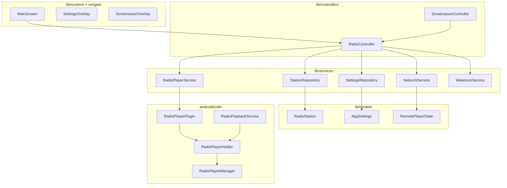

# Class overview — final project

Target structure for the Internet Radio Flutter app.  
**Legend:** ✅ exists · 🔲 planned

---

## Folder map

```
InternetRadioFlutter/
├── assets/
│   ├── settings.json              # Station list (build-time config)
│   └── images/                    # Station logos (PNG)
│
├── lib/
│   ├── main.dart                  # App entry, root wiring
│   ├── app/                       # App shell & dependency wiring
│   ├── models/                    # Data types (no I/O)
│   ├── services/                  # I/O & platform integrations
│   ├── controllers/               # Application logic (orchestration)
│   ├── screens/                   # Full-page UI
│   └── widgets/                   # Reusable UI pieces
│
└── android/app/src/main/
    ├── kotlin/.../internetradio/  # Native audio & platform channel
    └── java/.../internetradio/    # AudioRouteFixer (Java)
```

---

## Architecture flow


```mermaid
flowchart TB
  subgraph ui [lib/screens + widgets]
    MainScreen
    SettingsOverlay
    ScreensaverOverlay
  end

  subgraph ctrl [lib/controllers]
    RadioController
    ScreensaverController
  end

  subgraph svc [lib/services]
    RadioPlayerService
    StationRepository
    SettingsRepository
    NetworkService
    WakelockService
  end

  subgraph models [lib/models]
    RadioStation
    AppSettings
    RemotePlayerState
  end

  subgraph native [android/kotlin]
    RadioPlayerPlugin
    RadioPlayerHolder
    RadioPlayerManager
    RadioPlaybackService
  end

  MainScreen --> RadioController
  RadioController --> RadioPlayerService
  RadioController --> StationRepository
  RadioController --> SettingsRepository
  RadioController --> NetworkService
  RadioController --> WakelockService
  ScreensaverController --> RadioController
  StationRepository --> RadioStation
  SettingsRepository --> AppSettings
  NetworkService --> RemotePlayerState
  RadioPlayerService --> RadioPlayerPlugin
  RadioPlayerPlugin --> RadioPlayerHolder
  RadioPlaybackService --> RadioPlayerHolder
  RadioPlayerHolder --> RadioPlayerManager
```

---

## `lib/models/` — domain data (pure Dart)

No Flutter widgets, no platform channels, no file/network I/O.

| Class | Status | Responsibility |
|-------|--------|----------------|
| **`RadioStation`** | ✅ | One station: `name`, `url`, `imageAssetPath`. JSON via `fromJson` / `listFromSettingsJson`. |
| **`OperatingMode`** | ✅ | Enum: `player` \| `remote`. |
| **`AppSettings`** | ✅ | Persisted prefs: mode, player IP, last station name, test URL, display policy. |
| **`DisplayPolicy`** | ✅ | Enum: `keepScreenOn` \| `allowScreenOff`. Player mode. |
| **`RemotePlayerState`** | ✅ | Remote snapshot: station index, muted, playing, `stationTitle`, `nowPlaying`. |
| **`RadioPlayerState`** | ✅ | Live audio snapshot from native player: url, `PlaybackState` (`Idle`\|`Buffering`\|`Ready`\|`Ended`\|`Unknown`), isPlaying, isMuted, buffer, error, `retryInSeconds`, `streamStationName`, `nowPlaying`. DTO from MethodChannel/EventChannel. |

---

## `lib/services/` — integrations & I/O

Talks to assets, disk, network, or native code. No UI.

| Class | Status | Responsibility |
|-------|--------|----------------|
| **`RadioPlayer` / `RadioPlayerService`** | ✅ | Dart facade for native audio. `play`, `stop`, `setMuted`, `stateStream` (includes stream station name and now-playing). Owns MethodChannel + EventChannel. |
| **`StationRepository`** | ✅ | Load `assets/settings.json`, parse stations, fallback list. Expose stations (including URL-test slot), lookup by index/name. |
| **`SettingsRepository`** | ✅ | Read/write `AppSettings` via `shared_preferences`. |
| **`NetworkService`** | ✅ | TCP on port **6435**. Player: `startListener` / `stopListener`. Remote client: `sendCommand`, `ping`. |
| **`NetworkProtocol`** | ✅ | Port, timeout, command builders/parsers, `STATE\|index\|muted\|playing\|stationTitle\|nowPlaying` (`0`/`1`, titles percent-encoded). |
| **`WakelockService`** | ✅ | Keep screen on when **display policy** = `keepScreenOn` (Player mode). Off when `allowScreenOff` or Remote mode. |
| **`LocalNetworkInfo`** | ✅ | Local device IP for bottom-left display (Dart `NetworkInterface`). |

---

## `lib/controllers/` — application logic

Orchestrates services and exposes state for UI. Single place for “what happens when user taps X”.

| Class | Status | Responsibility |
|-------|--------|----------------|
| **`RadioController`** | ✅ | **Central controller.** Owns player, repositories, `NetworkService`, `WakelockService`. Player/Remote mode switch, TCP listener or 2.5s poll, station/mute (local or remote commands), settings open/IP/URL test, display-policy wakelock. Exposes `chromeStationTitle` / `chromeNowPlaying` for the top chrome. |
| **`ScreensaverController`** | ✅ | 60s inactivity timer, show/hide screensaver, reset on local touch. Disabled while settings open. **Dismiss on remote command** (via `RadioController`). Only meaningful when display is on (`keepScreenOn`). Uses current station logo from `RadioController`. |

*Alternative:* merge `ScreensaverController` into `RadioController` if you prefer one class — split only if screensaver logic grows.

---

## `lib/app/` — wiring

| Class | Status | Responsibility |
|-------|--------|----------------|
| **`InternetRadioApp`** | ✅ (in `main.dart`) | `MaterialApp`, theme, home route. |
| **`AppScope` / providers** | ✅ | `InheritedNotifier` for the single app-wide `RadioController`. Created in `main()` after loading repos. |

---

## `lib/screens/` — full pages

| Class | Status | Responsibility |
|-------|--------|----------------|
| **`MainScreen`** | ✅ | Main radio UI. Static controls inline in MainScreen: mute, mode toggle, IP, settings opener, exit, station name + now-playing. Composes `StationGrid`; stacks overlays. Reads `RadioController`. |

---

## `lib/widgets/` — extracted UI only

Extract when repeated, layout-heavy, or a separate layer. Everything else stays in `MainScreen`.

| Class | Status | Why separate | Responsibility |
|-------|--------|----------------|----------------|
| **`StationTile`** | ✅ | Repeated many times | One station button: logo or name fallback, selected highlight, onTap. |
| **`StationGrid`** | ✅ | Non-trivial layout | Scrollable grid: portrait 3 columns (vertical scroll), landscape 3 rows (horizontal scroll). |
| **`SettingsOverlay`** | ✅ | Different layer / lifecycle | Modal: player IP, connection test (`PING`), URL test (`TESTURL`), display policy (Player), save/close. |
| **`ScreensaverOverlay`** | ✅ | Different layer / lifecycle | Full-screen bouncing station logo; tap to dismiss. Active only when display policy = `keepScreenOn`. |
| **`MarqueeText`** | ✅ | Overflow ticker | Single-line scrolling text when a chrome line does not fit at a fixed font size. Used for station name and now-playing. |

---

## `lib/main.dart`

| Entry | Status | Responsibility |
|-------|--------|----------------|
| **`main()`** | ✅ | `runApp`, bootstrap `AppScope`, optional init (load stations, restore settings). |

---

## Android — `nl.siwoc.internetradio`

| Class | Status | Responsibility |
|-------|--------|----------------|
| **`MainActivity`** | ✅ | Flutter activity; registers `RadioPlayerPlugin` in `configureFlutterEngine`. |
| **`RadioPlayerPlugin`** | ✅ | MethodChannel / EventChannel handler; forwards to `RadioPlayerManager`. |
| **`RadioPlayerHolder`** | ✅ | Process-wide singleton holder for `RadioPlayerManager` (activity + service share one player). |
| **`RadioPlayerManager`** | ✅ | ExoPlayer (Media3): play/stop/mute, live buffer config, stream teardown on switch, transient-error retry with backoff, ICY/ID3/Vorbis now-playing metadata, state events, `AudioRouteFixer` on start. |
| **`RadioPlaybackService`** | ✅ | Foreground `MediaSessionService`: background playback, media notification, shares player via `RadioPlayerHolder`. |
| **`AudioRouteFixer`** | ✅ | Java helper: retrigger headphone routing after stream start (Moto-style devices). |

---

## Assets (not classes)

| Path | Responsibility |
|------|----------------|
| **`assets/settings.json`** | Station list at build time. |
| **`assets/images/*.png`** | Station logos referenced by `image` in JSON. |

---

## Responsibility cheat sheet

| Concern | Owner |
|---------|--------|
| Play MP3 / Icecast stream | `RadioPlayerManager` (Kotlin) |
| Dart ↔ Kotlin calls | `RadioPlayerService` + `RadioPlayerPlugin` |
| Which station is selected | `RadioController` |
| Load station list | `StationRepository` |
| Save mode / IP / last station / display policy | `SettingsRepository` |
| Remote control protocol | `NetworkService` + `NetworkProtocol` |
| Keep phone awake (Player) | `WakelockService` + **display policy** + `RadioController` |
| Draw station buttons | `StationGrid` / `StationTile` |
| Now-playing chrome | `RadioPlayerManager` metadata → `RadioPlayerState` → `RadioController.chromeStationTitle` / `chromeNowPlaying` → `MainScreen` + `MarqueeText`. Player includes those lines in TCP `STATE` for Remote. |
| 60s screensaver | `ScreensaverController` + `ScreensaverOverlay` (when screen stays on) |
| Remote command on Player | `NetworkService` → `RadioController` → audio + **dismiss screensaver** |

---

## What not to put where

| Avoid | Prefer |
|-------|--------|
| TCP parsing in widgets | `NetworkProtocol` / `NetworkService` |
| `MethodChannel` in screens | `RadioPlayerService` |
| ExoPlayer in Dart | `RadioPlayerManager` |
| JSON models in UI files | `lib/models/` |
| Business rules in `build()` | `RadioController` |
| One-off buttons/labels as widget files | Inline in `MainScreen` (or private `_…` at bottom of file) |

---

## Current vs final file count

**Today (Layer 0–1 + models):** Dart services + `lib/models/`; native Layer 0 complete.

**Final (approx.):** ~12–16 Dart files across `models`, `services`, `controllers`, `screens`, `widgets` (4); native Layer 0 complete.

See [todo.md](../todo.md) for build order (M1 → M4). Next: Layer 6.1 end-to-end Player polish.
